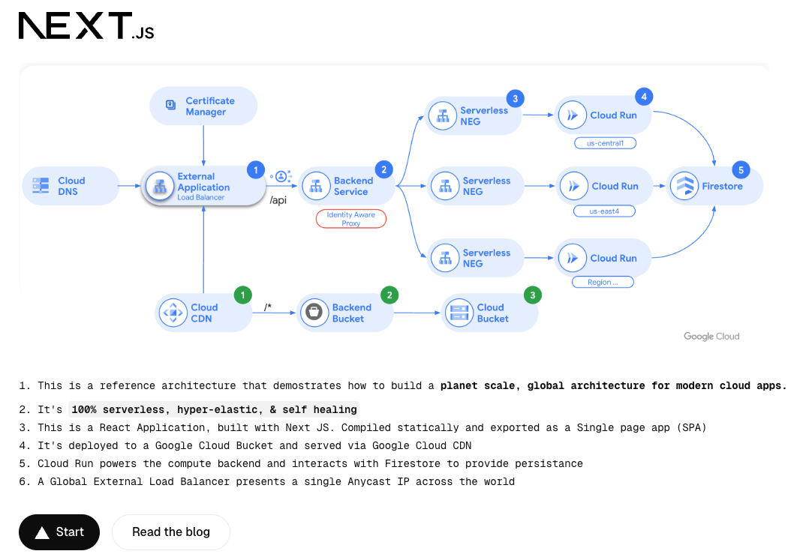

This is a [Next.js](https://nextjs.org) project bootstrapped with [`create-next-app`](https://nextjs.org/docs/app/api-reference/cli/create-next-app).

## Getting Started

This is a React Application, built with Next JS. Compiled statically and exported as a Single Page App (SPA). It can be deployed and hosted on any service capable of delivering HTTP responses, including Google Cloud CDN, Amazon CloudFront, and Heroku. The entire application runs client side without any need for a web server.

You can run it locally like this:

``` bash
npm run dev
# or
yarn dev
# or
pnpm dev
# or
bun dev
```

Open [http://localhost:3000](http://localhost:3000) with your browser to see the application.

You can start editing the main page by modifying `app/page.tsx`. The page auto-updates as you edit the file.



## Deploying to Production
``` bash
npm run build
```

This compiles the project and generates an `/out` directory. The contents of this should be deployed to your choice of compute. In my example, I use Google Cloud CDN and publish the build to a Google Cloud Storage Bucket (GCS).  Then, make the GCS bucket public and add it as an origin on Cloud CDN.

### Add the bucket as an origin
1. Cloud CDN is integrated with the Global External Load Balancer (GALB) so you need to create a Backend Bucket on the GALB and enable it for Cloud CDN


2. Add a routing rule to point all paths (/*) to be served by Cloud CDN


3. Set a default index file to be served and a 404 file

    ```bash
    gsutil web set -m index.html -e 404.html gs://gmao-web-app
    ```

Read in detail how to set this up at my Medium Post: [4 steps to supercharge Planet Scale, Global architectures on Google Cloud](https://medium.com/google-cloud/?) (To be published soon)

## Learn More about React and Next.js

To learn more about Next.js, take a look at the following resources:

- [Next.js Documentation](https://nextjs.org/docs) - learn about Next.js features and API.
- [Learn Next.js](https://nextjs.org/learn) - an interactive Next.js tutorial.

You can check out [the Next.js GitHub repository](https://github.com/vercel/next.js) - your feedback and contributions are welcome!
